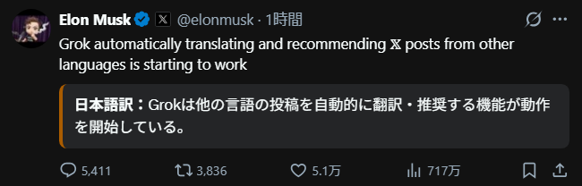
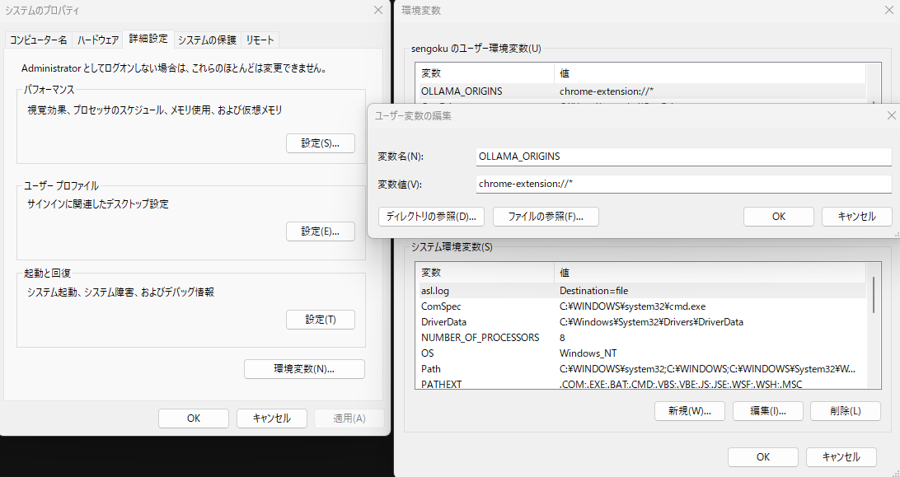

## xの英語記事をローカルapiで翻訳するブラウザ拡張

aiの学習を進めているとXの投稿で「翻訳を表示」を1日100回以上押していて、これ自動でよくないか？と思い開発。
外部apiだと高速（30フレ程）で処理可能ですが、有料になるのでデフォルトapiをローカルにしています。



◇ 前提
* Win11
* Ollama(llm:lfm2.5-thinking:latest)
** ollama インストール
** ollama run lfm2.5-thinking:latest
* chrome

---

## 🚀 インストール方法

1.  **ソースコードの準備**
    本リポジトリを `xhonyaku.zip` でダウンロードし、任意の場所へ解凍してください。
2.  **拡張機能ページを表示**
    ブラウザのアドレスバーに `chrome://extensions/` と入力して開きます。
3.  **デベロッパーモードを有効化**
    画面右上の **「デベロッパー モード」** スイッチをオンにします。
4.  **フォルダを読み込む**
    左上の **「展開して読み込む」** ボタンを押し、`manifest.json` が含まれているフォルダを選択します。
5.  **完了**
    拡張機能一覧にアイコンが表示されればインストール完了です。

---

## 💡 Ollama 接続のための設定（重要）

ブラウザのセキュリティ制限（CORS）により、
動作しない場合は、以下の手順で環境変数を設定し、Ollama を再起動してください。

### Windows
環境変数に追加
OLLAMA_ORIGINS
chrome-extension://*
<br>

### Windows (PowerShell)
```powershell
$env:OLLAMA_ORIGINS="chrome-extension://*"
ollama serve
```

## Mac / Linux 

```bash
OLLAMA_ORIGINS="chrome-extension://*" ollama serve
```
